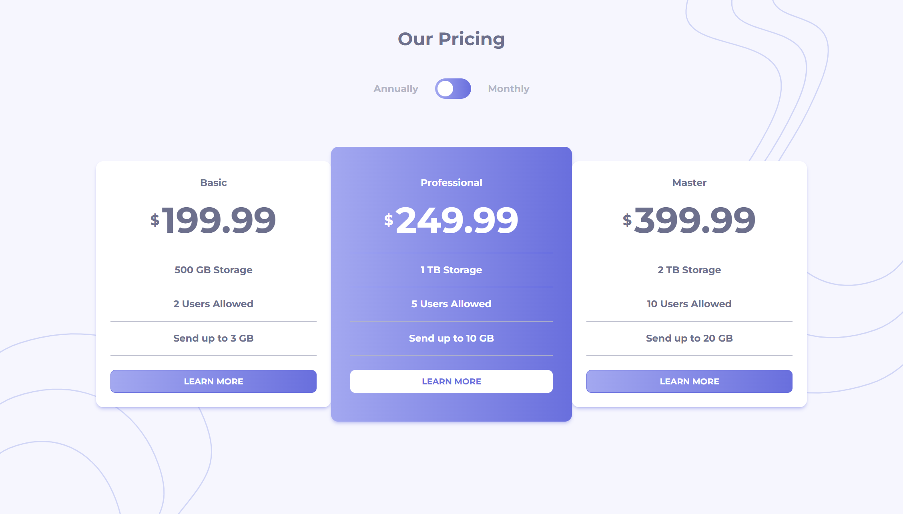
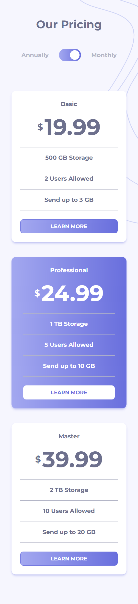

# Frontend Mentor - Pricing component with toggle solution

This is a solution to the [Pricing component with toggle challenge on Frontend Mentor](https://www.frontendmentor.io/challenges/pricing-component-with-toggle-8vPwRMIC). Frontend Mentor challenges help you improve your coding skills by building realistic projects. 

## Table of contents
- [Overview](#overview)
  - [The challenge](#the-challenge)
  - [Screenshot](#screenshot)
  - [Links](#links)
- [Built with](#built-with)
- [Author](#author)

## Overview

### The challenge

Users should be able to:

- View the optimal layout for the component depending on their device's screen size
- Control the toggle with both their mouse/trackpad and their keyboard

### Screenshot

### Links

- [Live site here](https://anne-mfl.github.io/pricing-component-with-toggle)

## Built with

- HTML
- CSS
- Tailwind CSS
- Flexbox
- [React](https://reactjs.org/) - JS library

## Author

- Frontend Mentor - [@anne-mfl](https://www.frontendmentor.io/profile/anne-mfl)
